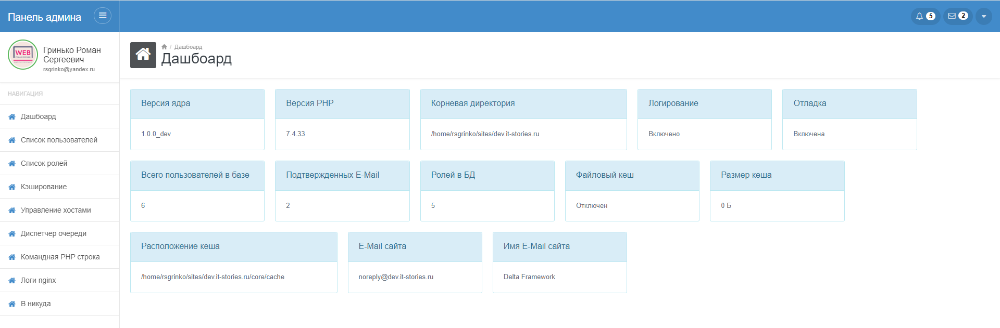
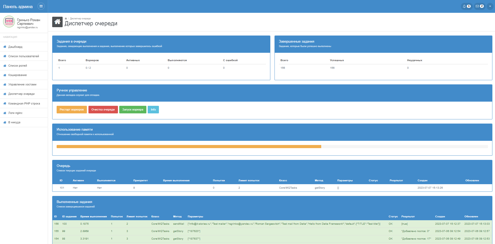
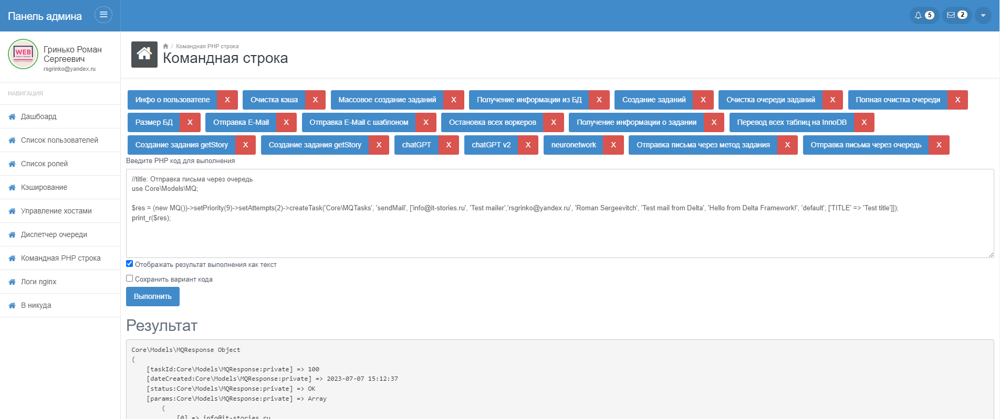

# Delta Framework

## Описание
Delta Framework - простой фреймворк для разработки веб проектов. Его разработка была начата в свободное от работы время и выполнялась полность в свое удовольствие.
На текущий момент в нем имеется:

- [X] Авторизация
- [X] Регистрация
- [X] Роли пользователей
- [X] Верификация E-Mail
- [X] Рассылки почты
- [X] Поддержка шаблонов почтовых отправлений
- [X] Менеджер очереди заданий
- [X] Шаблонизатор
- [X] Поддержка маршрутизации
- [X] REST API
- [X] Кеширование
- [X] Логирование
- [X] Работа с файлами
- [X] Миграции

***

## Скрины админки

### Дашбоард


### Менеджер очереди


### Командная строка


### Список пользователей


## Начало использования

Для начала получите проект любым удобным для вас способом (git clone, скачать...)

Далее в корне проекта выполните ```composer install``` для установки зависимостей.

Так как проект использует базу данных - настройте подключение к ней (```/core/config.php```)
```
    /** Параметры SQL базы */
    const DB_HOST     = 'localhost';
    const DB_USER     = 'vasya';
    const DB_PASSWORD = 'mysuperpassword';
    const DB_NAME     = 'deltacore';
```

Также настройте Phinx для использования миграций (```/phinx.php```)
```
    'host' => 'localhost',
    'name' => 'deltacore',
    'user' => 'vasya',
    'pass' => 'mysuperpassword',
```

Далее потребуется выполнить непосредственно сами миграции. В зависимости от окружения используйте ````dev```` или ````prod````.

Для примера выполним миграцию в окружение для разработки

````
    vendor/bin/phinx migrate -e dev
````

Доступ к панели управления находится тут
````https://site.ru/admin/````

Логин и пароль по умолчанию ````admin / admin````

## Участие в разработке

Если вас заинтересовал данный проект и у вас есть идеи как и что улучшить - добро пожаловать! Кидайте реквесты на рассмотрение.

***

## Контакты для связи
Если у вас возникли какие-либо вопросы или предложения - контакты для связи ниже.

- E-Mail: [rsgrinko@gmail.com](mailto:rsgrinko@gmail.com)
- Telegram [@rsgrinko](https://t.me/rsgrinko)
