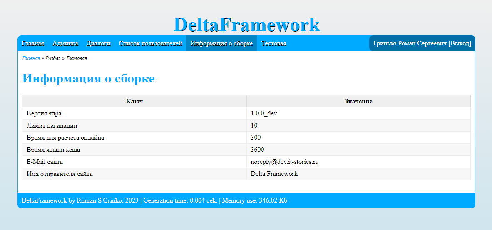

# Delta Framework

## Описание
Delta Framework - простой фреймворк для разработки веб-проектов. Его разработка была начата в свободное от работы время и выполнялась полность в свое удовольствие.
На текущий момент в нем имеется:

- [X] Авторизация
- [X] Регистрация
- [X] Роли пользователей
- [X] Верификация E-Mail
- [X] Рассылки почты
- [X] Поддержка шаблонов почтовых отправлений
- [X] Менеджер очереди заданий
- [X] Шаблонизатор
- [X] Поддержка маршрутизации
- [X] REST API
- [X] Кеширование
- [X] Логирование
- [X] Работа с файлами
- [X] Миграции
- [X] Captcha
- [X] DDoS Guard (basic)

***

## Панель администратора
Панель находистя по адресу `/admin/` и предоставляет базовые возможности по управлению системой.

### Дашбоард


### Менеджер очереди


### Командная строка


### Список пользователей


## Пользовательская часть
Пользовательская часть построена с использованием шаблонизатора Twig.
Шаблоны располагаются в папке `/templates/`. Для приложения имеется единая точка входа - это `/index.php`.
Маршруты располагаются в файле `/core/routes.php`, а контроллером приложения по умолчанию является файл `/core/lib/App.class.php`.

### Пример нового маршрута
```
/**
 * Добавим маршрут, который открывает страницу информации о конкретном пользователе
 * URL может иметь вид https://site.ru/users/123
 * 123 в даннмо случае идентификатор пользователя
 *
 * Вторым аргументом следует метод класса, который будет обрабатывать данный запрос
 * В текущем примере это класс \Core\App и его метод userProfile (туда передается идентификатор пользователя из запроса)
 */
Router::route('/users/(\d+)', '\Core\App::userProfile');


/**
 * Также добавим новый маршрут, который не будет вызывать метод, а сам отдаст результат
 */
Router::route('/test', function () {
        echo 'This is test page!';
    });
```

### Пример нового обработчика маршрута
Для примера рассмотрим как реализован маршрут с информацией о конкретном пользователе

```
/**
 * В данном обработчике мы принимаем идентификатор пользователя (из примера выше)
 * и показываем информацию о нем.
 *
 * Метод self::render() принимает в качестве аргумента файл шаблона
 * и массив данных для подстановки в сам шаблон.
 * Также он производит дополнение переданных данных обязательными полями,
 * такими как: авторизован ли, админ ли, данные текущего пользователя...
 */
public static function userProfile(int $id)
{
    $userData = (new User($id))->getAllUserData(true);
    self::render('userProfile.twig', ['userData' => $userData]);
}
```

### Главная страница


### Список пользователей


### Страница информации



## Начало использования

Для начала получите проект любым удобным для вас способом (git clone, скачать...)

Далее в корне проекта выполните ```composer install``` для установки зависимостей.

Так как проект использует базу данных - настройте подключение к ней (```/core/config.php```)
```
    /** Параметры SQL базы */
    const DB_HOST     = 'localhost';
    const DB_USER     = 'vasya';
    const DB_PASSWORD = 'mysuperpassword';
    const DB_NAME     = 'deltacore';
```

Также настройте Phinx для использования миграций (```/phinx.php```)
```
    'host' => 'localhost',
    'name' => 'deltacore',
    'user' => 'vasya',
    'pass' => 'mysuperpassword',
```

Далее потребуется выполнить непосредственно сами миграции. В зависимости от окружения используйте ````dev```` или ````prod````.

Для примера выполним миграцию в окружение для разработки

````
    vendor/bin/phinx migrate -e dev
````

Для использования некой многосайтовости предусмотрено подключение локального файла конфигурации.

Пример: вы примонтировали в рядом лежащий проект папки `/core/`, `/upload/`, `/admin/`.
Вам следует создать в корне проекта файл `config.local.php` и переопределить параметры для текущего проекта.

Файл локальной конфигурации является необязательным в случае если переопределение настроек не требуется, однако если его создать - можно точечно переопределить некоторые параметры (например, используемая БД и префикс таблиц).

Доступ к панели управления находится тут
````https://site.ru/admin/````

Логин и пароль по умолчанию ````admin / admin````

## Участие в разработке

Если вас заинтересовал данный проект и у вас есть идеи как и что улучшить - добро пожаловать! Кидайте реквесты на рассмотрение.

***

## Контакты для связи
Если у вас возникли какие-либо вопросы или предложения - контакты для связи ниже.

- E-Mail: [rsgrinko@gmail.com](mailto:rsgrinko@gmail.com)
- Telegram [@rsgrinko](https://t.me/rsgrinko)
